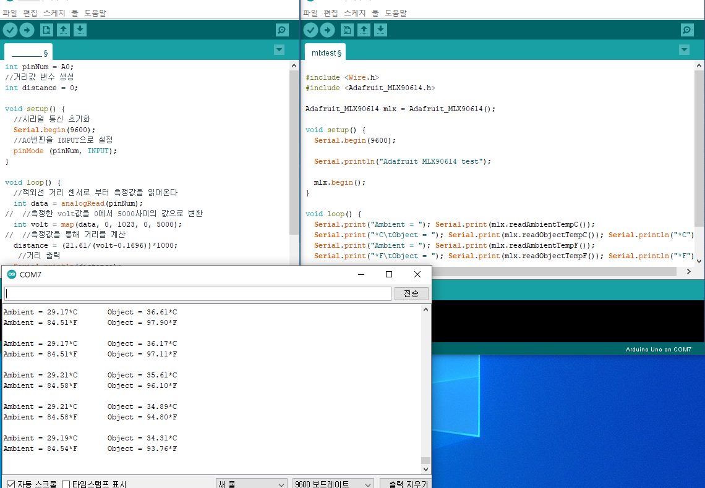

# 김학준[B308]

## 0715

1. opencv 이미지매칭(feature match)

   ```python
   import numpy as np
   import cv2
from matplotlib import pyplot as plt
   
   img1 = cv2.imread('soocard2.jpg',0) # 라즈베리 파이로 찍은 명찰사진
   
   imgs = {'kyungseok':'profile.jpg',
           'hakjun':'hakprofile.jpg',
           'moonseok':'moonprofile.jpg',
           'kyungsoo':'sooprofile.jpg'
           } #DB에 있는 학생들 사진들
   
   match = 0
   student = ''
   for i in imgs.keys():
       img2 = cv2.imread(imgs[i],0)
       sift = cv2.xfeatures2d.SIFT_create()
       kp1, des1 = sift.detectAndCompute(img1,None)
       kp2, des2 = sift.detectAndCompute(img2,None)
       bf = cv2.BFMatcher()
       matches = bf.knnMatch(des1,des2, k=2)
       good = []
       for m,n in matches:
           if m.distance < 0.5*n.distance:
               good.append([m])
       print(len(good))
       if match < len(good):
           match = len(good)
           student = i
   
   print(f'반갑습니다 {student} 님')
   img = cv2.imread(imgs[student],0)
   plt.imshow(img)
   
   
   # img3 = cv2.drawMatchesKnn(img1,kp1,img2,kp2,good,None,flags=2)
   # plt.imshow(img3),plt.show()
   ```
   

## 0717,0718

1. 아두이노를 통한 센서활용 및 센서값출력

   

   

## 0720

1. ERD 모델링 생성

   

2. jira, git flow 연습및 활용


## 0721

1. 라즈베리파이 OS 설치, 기본세팅 완료

   

## 0722

1. 라즈베리 파이 maria db 설치, pc와 연동후 테이블(model) 생성

   ```python
   sudo mysql -u b308[user] -p 로접속
   create database [테이블이름]; 테이블생성
   use [테이블이름];
   ```

   

2. ERD 수정

   

   

## 0723

1. 적외선 온도센서

   ```
   mlx90614라이브러리 설치
   sudo pip3 install adafruit-circuitpython-mlx90614
   ```

2. 센서값 mariadb 저장

   ```python
   import pymysql
   import board
   import busio as io
   import adafruit_mlx90614
   import time
   import sys
   
   i2c = io.I2C(board.SCL, board.SDA, frequency=100000)
   mlx = adafruit_mlx90614.MLX90614(i2c)
   obj = round(mlx.object_temperature,2)
   amb = round(mlx.ambient_temperature,2)
   
   conn = pymysql.connect(host="localhost",
          user="b308",
          passwd="b308",
          db="sensor_test")
   try:
      with conn.cursor() as cur :
          sql="insert into collect_data values(%s, %s, %s, %s)"
          cur.execute(sql,
                  ('mlx90614',time.strftime("%Y-%m_%d %H:%M",time.localtime()),
                      obj,amb))
          conn.commit()
   finally:
      conn.close()
   ```

3. 라즈베리파이 카메라 모듈 설치

   