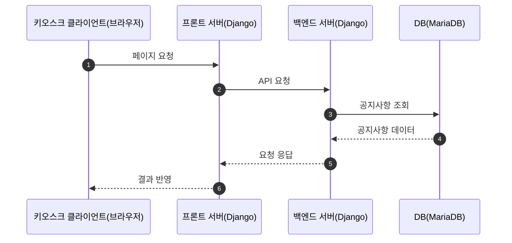
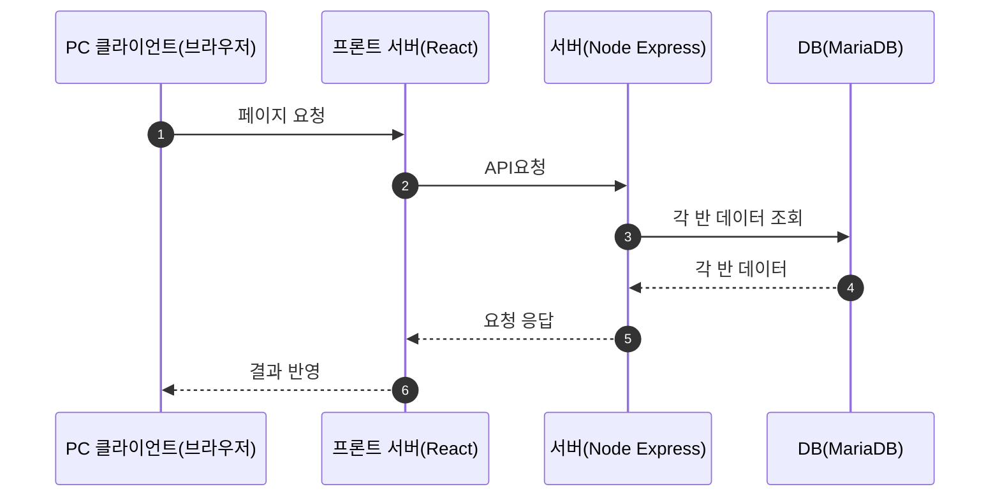
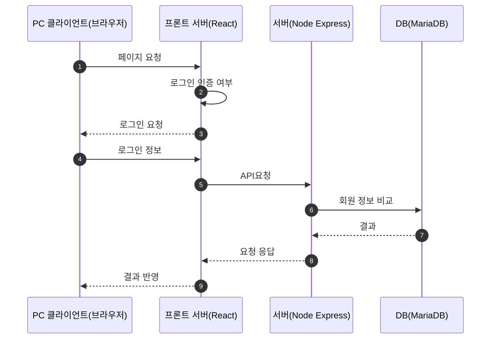

## 키오스크 시퀀스 다이어그램

<script>
  mermaid.initialize({
    sequence: { showSequenceNumbers: true },
  });
</script>

1. 메인화면 - 공지사항



2. 명찰 인식

   ```mermaid
   sequenceDiagram
       autonumber

         키오스크 클라이언트(브라우저)->>프론트 서버(Django): 페이지 요청
         프론트 서버(Django)-->>키오스크 클라이언트(브라우저): 렌더링
         카메라 센서(아두이노 & 라즈베리파이)-->>키오스크 클라이언트(브라우저): 데이터 전송
         키오스크 클라이언트(브라우저)->>프론트 서버(Django): 데이터 전송
         프론트 서버(Django)->>백엔드 서버(Django): API 요청
         백엔드 서버(Django)->>DB(MariaDB) : 데이터 비교
         백엔드 서버(Django)-->>프론트 서버(Django): 요청 응답
         프론트 서버(Django)-->>키오스크 클라이언트(브라우저): 결과 반영
   ```

3) 설문 조사

   ```mermaid
    sequenceDiagram
       autonumber
     키오스크 클라이언트(브라우저)->>프론트 서버(Django): 페이지 요청
     프론트 서버(Django)-->>키오스크 클라이언트(브라우저): 렌더링
     체온 센서(아두이노 & 라즈베리파이)-->>키오스크 클라이언트(브라우저): 데이터 전송
     LCD 터치 스크린-->>키오스크 클라이언트(브라우저): 데이터 전송
      키오스크 클라이언트(브라우저)->>프론트 서버(Django): 데이터 전송
    프론트 서버(Django)->>백엔드 서버(Django): API 요청
     백엔드 서버(Django)->>DB(MariaDB) : 데이터 입력
     백엔드 서버(Django)-->>프론트 서버(Django): 요청 응답
     프론트 서버(Django)-->>키오스크 클라이언트(브라우저): 결과 반영
   ```

## PC 시퀀스 다이어그램

1.메인화면



2.각 기능 요청 중 로그인이 안되어있을 때



3. 공지사항

   ```mermaid
   sequenceDiagram
       autonumber
        PC 클라이언트(브라우저)->>프론트 서버(React):페이지 요청
       프론트 서버(React)->>서버(Node Express):API요청
         서버(Node Express)->>DB(MariaDB) : CRUD
         DB(MariaDB)-->>서버(Node Express) : 데이터
         서버(Node Express)-->>프론트 서버(React):요청 응답
         프론트 서버(React)-->>PC 클라이언트(브라우저): 결과 반영
   ```

   4.설문 조사 및 관리

   ```mermaid
   sequenceDiagram
       autonumber
        PC 클라이언트(브라우저)->>프론트 서버(React):페이지 요청
       프론트 서버(React)->>서버(Node Express):API요청
         서버(Node Express)->>DB(MariaDB) : CRUD
         DB(MariaDB)-->>서버(Node Express) : 데이터
         서버(Node Express)-->>프론트 서버(React):요청 응답
         프론트 서버(React)-->>PC 클라이언트(브라우저): 결과 반영
   ```

4. 회원 기능

   ```mermaid
   sequenceDiagram
       autonumber
        PC 클라이언트(브라우저)->>프론트 서버(React):페이지 요청
       프론트 서버(React)->>서버(Node Express):API요청
         서버(Node Express)->>DB(MariaDB) : CRUD
         DB(MariaDB)-->>서버(Node Express) : 데이터
         서버(Node Express)-->>프론트 서버(React):요청 응답
         프론트 서버(React)-->>PC 클라이언트(브라우저): 결과 반영
   ```
